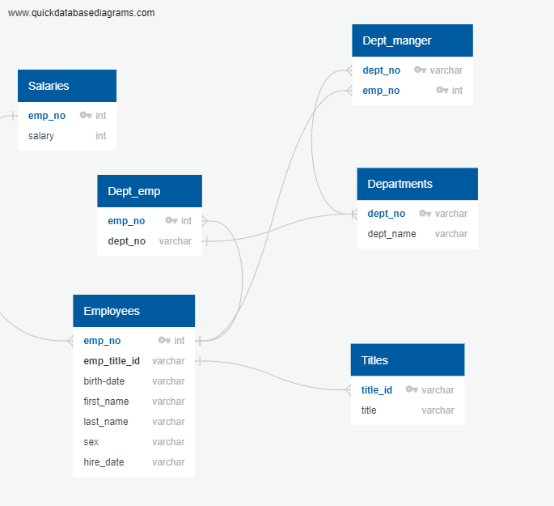
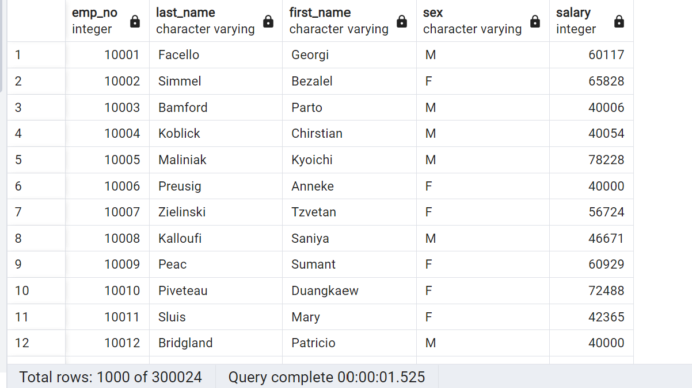
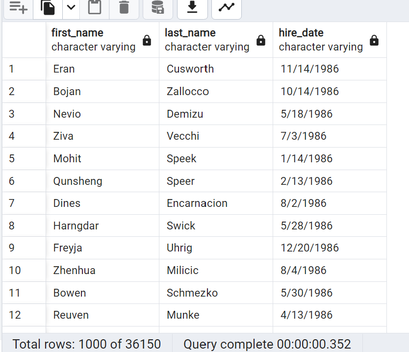
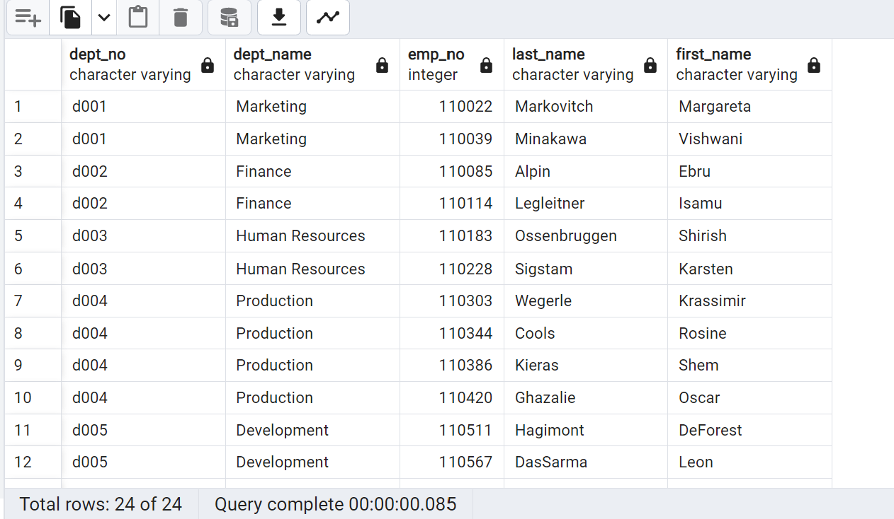
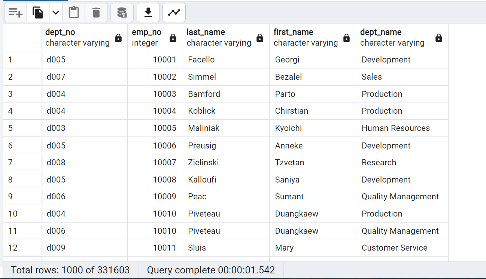
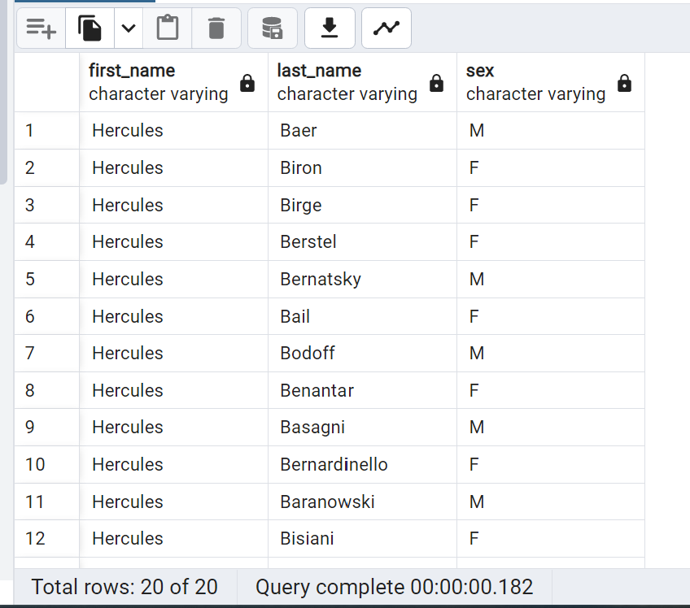
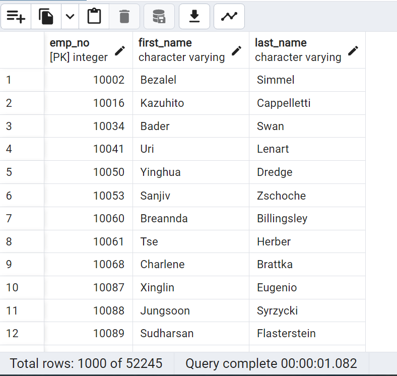
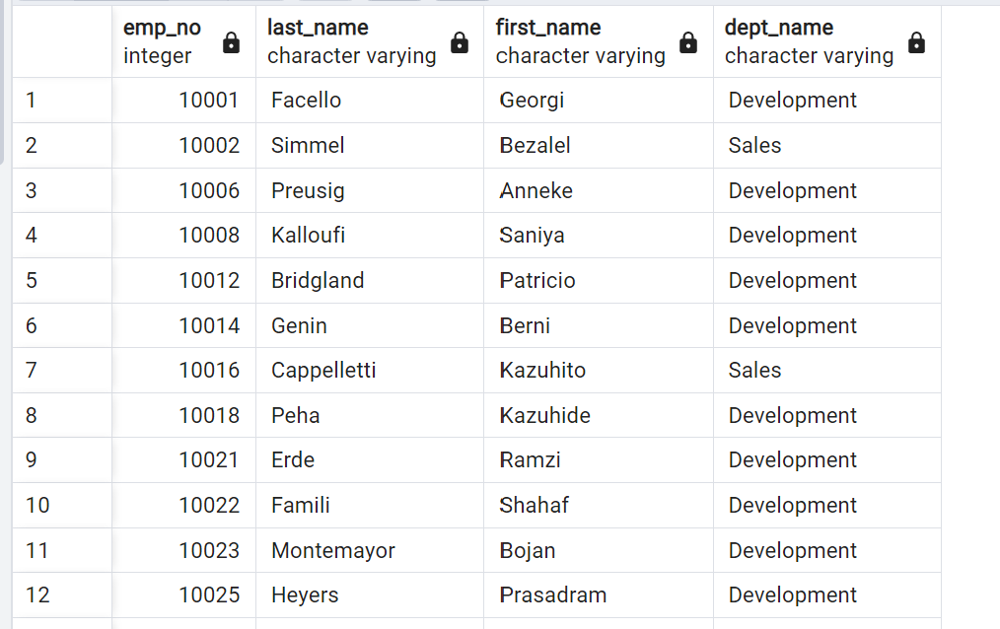
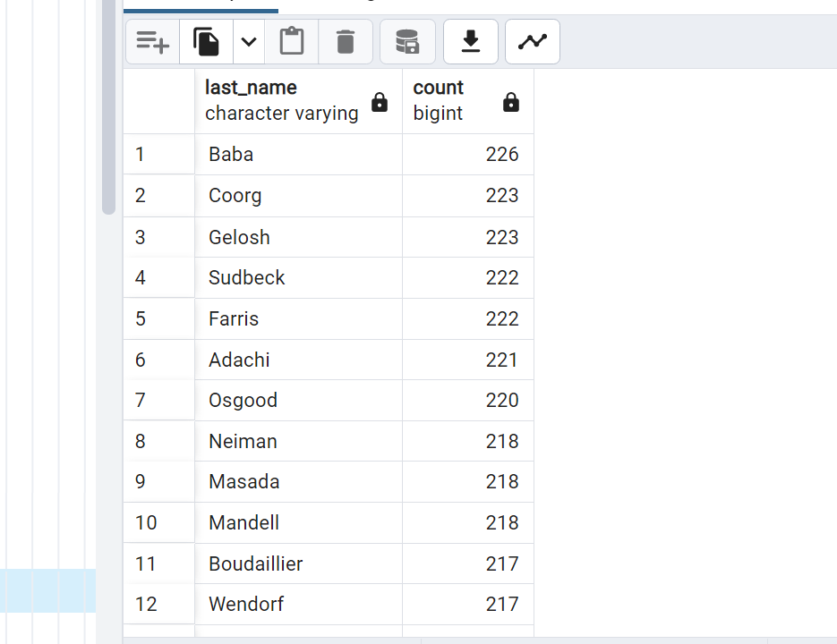

# Project Description 
## For this project I designed tables that holds data from 6 CSV files, import the CSV files into a SQL database, and then answered questions about the data.

## This project utilizes data modeling, data engineering, and data analysis. 

## An Entity Relationship Diagram (ERD) of the Tables was created using QuickDBD.
 

# Data Analysis 
## List the employee number, last name, first name, sex, and salary of each employee.

## List the first name, last name, and hire date for the employees who were hired in 1986.

## List the manager of each department along with their department number, department name, employee number, last name, and first name.

## List the department number for each employee along with that employee’s employee number, last name, first name, and department name.

## List first name, last name, and sex of each employee whose first name is Hercules and whose last name begins with the letter B.

## List each employee in the Sales department, including their employee number, last name, and first name.

## List each employee in the Sales and Development departments, including their employee number, last name, first name, and department name.

## List the frequency counts, in descending order, of all the employee last names (that is, how many employees share each last name).

